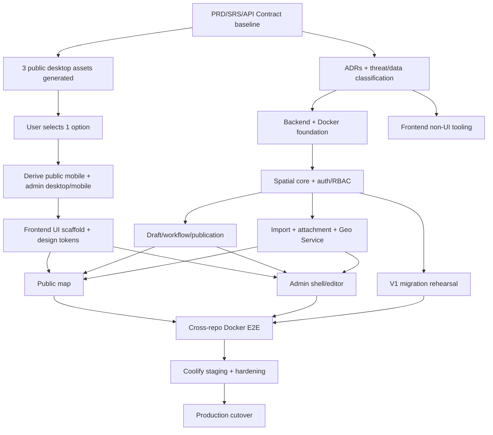

# Kế hoạch triển khai — DanangMap v2

## 1. Mục đích và nguyên tắc điều phối

Tài liệu này chuyển PRD/SRS/API Contract/Design thành dependency map, milestone, backlog có thể đưa vào GitHub Project, quality gate và runbook phát hành. Hai repository private được triển khai độc lập nhưng dùng một contract chung:

- `duckvhuynh/danangmap-frontend`
- `duckvhuynh/danangmap-backend`

Checklist thực thi theo task 30–60 phút, vertical slice, Docker E2E và commit checkpoint được duy trì tại `docs/EXECUTION-CHECKLIST.md`. `PLANS.md` vẫn là nguồn dependency/milestone đầy đủ; checklist không thay thế bất kỳ acceptance criteria nào trong backlog 169 ID.

Nguyên tắc:

1. Backend/OpenAPI là contract source of truth; frontend dùng generated typed client và không tự suy đoán response.
2. PostgreSQL/PostGIS là data source of truth; Dexie chỉ là crash-recovery buffer.
3. Draft/private data bị chặn tại backend projection/authorization boundary.
4. Publish theo immutable snapshot và atomic pointer switch.
5. Migration production dùng TypeORM migration; không dùng `synchronize`.
6. Traceability được quản lý bằng ma trận nhóm requirement ở §5.9; mỗi GitHub issue kế thừa nhóm đó và phải ghi requirement ID cụ thể khi được chuyển sang `Ready`.
7. Không thêm MongoDB; Redis chỉ dùng queue/cache/coordination, MinIO dùng object storage.
8. Backup nằm ngoài phạm vi và là accepted risk; không được mô tả publication snapshot như một bản backup.
9. Public API là unauthenticated read surface với DanangMap là supported client duy nhất trong MVP; CORS không phải authorization, nên phải có rate limit/abuse monitoring.

## 2. Gate thiết kế bắt buộc

**GATE-DESIGN status: `SELECTED_READY_TO_SCAFFOLD`; selection/source-of-truth được ghi tại frontend `2d35ec5`, visual QA follow-up hoàn tất tại `0899ebd` ngày 2026-08-21. `C-016` đã hoàn tất.**

- Ba public desktop visual directions gốc vẫn được giữ tại `docs/visual-directions/direction-1.png`, `direction-2.png`, `direction-3.png` trong `danangmap-frontend`.
- Product owner đã phê duyệt **Direction 1 — Civic Focus (refined)** tại `docs/visual-directions/direction-1-refined.png`; đây là refinement của Direction 1, không phải hướng thứ tư.
- Product Design đã derive đúng hướng được chọn thành `direction-1-public-mobile.png`, `direction-1-admin-editor-desktop.png` và `direction-1-admin-review-mobile.png`.
- `DESIGN.md` đã ghi decision/date, Tabler Icons, semantic blue, Google Maps web-like control radius/elevation và trạng thái `SELECTED_READY_TO_SCAFFOLD`.
- UI scaffold, shadcn theme/component và production screen được phép bắt đầu từ sau commit `2d35ec5`, phải bám source/derived artifacts và không trộn Direction 2/3 nếu chưa có vòng review mới.
- Visual QA follow-up `0899ebd` đã bỏ badge `v2` trên public mobile và làm phẳng primary CTA ở public mobile/admin review mobile; frontend `C-016` issue có đủ evidence để đóng.

## 3. Dependency map



Đường găng: baseline → 3 public desktop assets → user selection → derive admin/mobile → UI scaffold → editor/public UI → Docker E2E → staging → release. Các bước selection/derive/visual QA đã hoàn tất tại `2d35ec5` + `0899ebd`; backend bốn-format import/equivalence đạt tại `bd5013b` với CI `32448008945` xanh, frontend typed wizard pin cùng contract đạt tại `ab806d6`. Vị trí hiện tại trên đường găng là hoàn tất history/diff/rollback/audit trên nền three-actor workflow, sau đó browser cross-stack và các gate còn mở trong `docs/EXECUTION-CHECKLIST.md`.

## 4. Milestone và exit criteria

| Milestone | Phạm vi | Exit criteria |
| --- | --- | --- |
| M0 — Baseline & design decision | PRD/SRS/API/DESIGN/PLAN, ADR, 3 assets, chọn option, derive admin/mobile | Tài liệu baseline được duyệt; `C-016` done; không còn quyết định P0 mở |
| M1 — Foundation | Repo tooling, Docker, PostGIS, Redis worker, MinIO, CI, health, branch protection | Fresh Docker stack khởi động; migrations chạy; `C-017` và required checks hoạt động |
| M2 — Identity & spatial core | Account/MFA/session/RBAC, layer/schema/feature/version/geometry | CRUD + allow/deny integration tests xanh; geometry fixtures hợp lệ |
| M3 — Workflow & publication | Draft, review, approve, publish, rollback, audit, public projection | Separation-of-duties deny tests xanh; publish atomic; durable idempotency replay/concurrency trả original result; private/draft leak = 0; circle giữ canonical `Point + radiusM` qua mutation/public projection và MVT sinh polygon theo bán kính mét |
| M4 — Import, attachment & external search | 4 parsers, import guardrails, quarantine/scan/binding, MinIO, Geo Service adapter | Boundary suite 25 MiB/record/vertex/XLSX/property/report; atomic/skip-invalid; import apply idempotency dùng durable receipt/hash; attachment clean-only; partial external failure đạt |
| M5 — Public map | Full map, street/light, GeoJSON/MVT, layers/renderers/search/detail/list/mobile | Public Playwright desktop/mobile và accessibility checks xanh; circle hiển thị theo bán kính mét bằng polygonal representation, không dùng marker bán kính pixel cố định |
| M6 — Admin application | User/layer/schema/editor/Dexie/import/review/publish UI | Desktop authoring + crash recovery + mobile review E2E xanh |
| M7 — V1 migration | Manifest, transforms, rehearsals, reconciliation | Count/checksum/geometry report và product-owner sign-off |
| M8 — Hardening & release | Performance/security, Coolify staging, runbooks, cutover | Go/no-go signed; smoke xanh; accepted no-backup risk được ghi nhận |

`bd5013b` đóng sub-gate backend parser/mapping/apply/equivalence và upload replay của M4; CI `32448008945` đã xanh toàn bộ. Frontend wizard pin tại `ab806d6` đóng sub-gate UI riêng. M4 vẫn `In Progress` cho real cross-stack/imported-feature publication, attachment quarantine/scan/binding, Geo Service/external partial-failure và toàn bộ exit criteria còn lại.

Draft PR backend `#13` tại `6800ff6` có CI `32449796541` xanh cho controlled-publication HTTP, deny matrix, private redaction, atomic pointer failure và hai fresh-volume container smoke runs. Evidence này vẫn là `Partial` cho tới khi PR được review/merge; nó không thay thế Playwright chạy frontend thật, imported-feature publication hoặc issue cross-stack `#11`.

History/diff/rollback/audit checkpoint hiện có artifact OpenAPI **73 operations** và final local suites unit **47**, integration **38**, E2E **41**. Evidence này chỉ xác nhận bounded feature-level diff, immutable history/audit, publication-pointer ETag, synchronous terminal-only publish và atomic rollback; không xác nhận durable BullMQ publication-job progress hoặc attachment diff. Backend issue `#30` và frontend issue `#19` tiếp tục **Open / In Progress** cho hai capability follow-up đó và browser UI evidence; không được chuyển Done từ các count test này.

## 5. Issue-ready backlog

Quy ước dependency: `—` là không phụ thuộc issue khác; nhiều ID cách nhau bằng dấu phẩy. Mỗi issue phải nhỏ hơn hoặc bằng một ngày phát triển; nếu estimation vượt quá thì tách theo fixture, endpoint, screen state hoặc test layer trước khi chuyển sang `Ready`.

### 5.1 Cross-product, contract và architecture

| ID | Công việc | Repo | Depends on | Acceptance criteria |
| --- | --- | --- | --- | --- |
| C-001 | Baseline bộ PRD/SRS/API/PLANS backend và cross-link DESIGN frontend | `danangmap-backend` | — | 4 backend docs baseline; link tới frontend DESIGN; version/date/decision không mâu thuẫn |
| C-002 | ADR topology hai repo và modular monolith | `danangmap-backend` | C-001 | ADR khóa Next app `/` + `/admin`, Nest API/worker, PostGIS/Redis/MinIO, no Mongo |
| C-003 | Baseline OpenAPI-first và error envelope | `danangmap-backend` | C-001 | Contract định nghĩa versioning, pagination, errors, idempotency và auth semantics |
| C-004 | Environment/secrets matrix | `danangmap-backend` | C-002, C-003 | Dev/test/staging/prod variables có owner, secret/public flag, không có giá trị bí mật thật |
| C-005 | Register/QA chính xác 3 public desktop visual assets đã sinh | `danangmap-frontend` | C-001 | Chỉ có direction-1/2/3; file mở được, cùng viewport/state, trắng/xanh, no gradient, có rationale/trade-off |
| C-006 | Ghi nhận lựa chọn visual của người dùng | `danangmap-frontend` | C-005 | Chỉ một asset là selected; `DESIGN.md` có artifact path, decision/date; gate vẫn khóa để derive |
| C-007 | ADR Circle/multi/mixed + Terra Draw spike protocol | `danangmap-backend` | C-002 | Khóa Point+radius_m, geometry allow-list, round-trip fixtures và tiêu chí spike |
| C-008 | Data classification cho public/private/credential/audit | `danangmap-backend` | C-001 | Mỗi loại field/file/log có classification và serialization/storage policy |
| C-009 | Threat model auth/upload/publish/external adapter | `danangmap-backend` | C-003, C-008 | Có trust boundaries, abuse cases, mitigation và security test mapping |
| C-010 | Cross-repo version compatibility policy | `danangmap-backend` | C-003 | Khóa SemVer/API compatibility window, backend-first deploy và breaking-change gate |
| C-011 | GitHub issue/PR templates và CODEOWNERS | `danangmap-backend` | C-001 | Template bắt buộc Requirement/AC/Dependency/Test/Risk; docs/API có owner review |
| C-012 | GitHub Project cấu hình delivery | `danangmap-backend` | C-011 | Fields/views/status ở mục 9 tồn tại và link cả hai repo private |
| C-013 | Observability naming và correlation convention | `danangmap-backend` | C-002 | Request/job/publication/import IDs, log fields và metric labels được khóa |
| C-014 | Performance budget và test dataset profile | `danangmap-backend` | C-001 | Có p75/p95 targets, dataset small/medium/large và rule chọn GeoJSON hay MVT theo bbox/zoom/layer |
| C-015 | Release accepted-risk register | `danangmap-backend` | C-008, C-009 | No-backup risk và giới hạn rollback được chủ sản phẩm ghi nhận trước M8 |
| C-016 | Derive selected direction thành public mobile/admin desktop/admin review mobile | `danangmap-frontend` | C-006 | Chỉ derive từ option đã chọn; artifact/source và DESIGN cập nhật; GATE-DESIGN chuyển `SELECTED_READY_TO_SCAFFOLD` |
| C-017 | Branch protection và required checks cho hai repo | `danangmap-backend` | C-011, C-012 | `main` cấm force-push, merge qua PR, required CI/review áp dụng cho frontend và backend |

### 5.2 Backend foundation, identity và platform

| ID | Công việc | Repo | Depends on | Acceptance criteria |
| --- | --- | --- | --- | --- |
| B-001 | Scaffold NestJS API/worker workspace | `danangmap-backend` | C-002 | API và worker build/test độc lập; config validation fail-fast |
| B-002 | Docker image API/worker non-root | `danangmap-backend` | B-001 | Multi-stage image, non-root, graceful shutdown, reproducible lockfile build |
| B-003 | PostGIS TypeORM datasource và baseline migration | `danangmap-backend` | B-001 | Extension PostGIS, migrations table, UUID support; `synchronize=false` |
| B-004 | Redis/BullMQ connection và worker lifecycle | `danangmap-backend` | B-001 | Job enqueue/consume/retry test; shutdown không mất job đang commit |
| B-005 | MinIO/S3 adapter | `danangmap-backend` | B-001, C-004 | Bucket/key policy, presign abstraction và health probe test được |
| B-006 | Health/readiness endpoints | `danangmap-backend` | B-003, B-004, B-005 | Liveness không gọi downstream; readiness kiểm tra DB/Redis/migration; MinIO có trạng thái dependency riêng |
| B-007 | Request ID, error envelope và structured logger | `danangmap-backend` | B-001, C-003, C-013 | Mọi response/error có correlation ID; log không chứa credential/private payload |
| B-008 | User/role/session schema migration | `danangmap-backend` | B-003, C-008 | Constraints/index/soft-disable/session-revoke fields đúng contract |
| B-009 | Password login + secure cookie session | `danangmap-backend` | B-008 | Argon2id, HttpOnly/Secure/SameSite policy, rotate/revoke và allow/deny tests |
| B-010 | Login throttling/lockout/audit | `danangmap-backend` | B-009, B-014 | Rate limit và lockout không lộ account existence; events được audit |
| B-011 | TOTP enrollment/challenge/recovery code | `danangmap-backend` | B-009 | Secret được bảo vệ, recovery code one-time/hash, MFA-required policy test |
| B-012 | Manual account create/disable/role assignment | `danangmap-backend` | B-008, B-014 | System Admin thao tác được; session bị thu hồi khi disable; audit đầy đủ |
| B-013 | Invite account lifecycle | `danangmap-backend` | B-011, B-012, B-059 | Token one-time/hashed/expiry, accept sets password+MFA, mail queued, replay bị từ chối |
| B-014 | Append-only audit event service | `danangmap-backend` | B-003, C-008 | Actor/action/subject/reason/time/correlation ID; update/delete bị chặn ở service |
| B-015 | Import account file | `danangmap-backend` | B-012, B-013, B-014 | Dry-run duplicate/error report; valid accounts created inactive/invite state và mail delivery theo contract |
| B-016 | RBAC guard và permission matrix | `danangmap-backend` | B-008, C-003 | Editor/Reviewer/Publisher/System Admin allow+deny table có integration tests |
| B-017 | Separation-of-duties policies | `danangmap-backend` | B-016 | Author cannot review; prior Editor/Reviewer cannot publish; System Admin no bypass tests |

### 5.3 Backend spatial domain, workflow và public read

| ID | Công việc | Repo | Depends on | Acceptance criteria |
| --- | --- | --- | --- | --- |
| B-018 | Layer/group/revision schema migration | `danangmap-backend` | B-003, C-007 | Stable layer ID, immutable revision fields, status constraints và indexes |
| B-019 | Layer-field schema migration | `danangmap-backend` | B-018, C-008 | Stable key, type/icon/order/validation/public/search/filter constraints |
| B-020 | Feature/version/revision-link schema migration | `danangmap-backend` | B-018 | UUID feature, immutable versions, PostGIS geometry, JSONB properties, spatial index |
| B-021 | Publication snapshot/pointer schema migration | `danangmap-backend` | B-020 | Snapshot immutable, one active pointer/layer, transactional constraints |
| B-022 | Layer/group CRUD service | `danangmap-backend` | B-018, B-016 | Create/update/archive/list theo contract; unauthorized actions denied/audited |
| B-023 | Field schema compiler/validator | `danangmap-backend` | B-019 | Reject invalid keys/types/defaults; public/private projection metadata được tạo |
| B-024 | Geometry type/SRID/validity validator | `danangmap-backend` | B-020, C-007 | Fixture point/line/polygon/multi/mixed pass; wrong SRID/type/invalid polygon fail |
| B-025 | Circle center/radius validator | `danangmap-backend` | B-024 | `radius_m > 0`, center EPSG:4326, render polygon không ghi làm canonical geometry |
| B-026 | Draft revision creation/service | `danangmap-backend` | B-020, B-022, B-023 | Một active working draft/layer; base publication/version fingerprint được lưu |
| B-027 | Feature CRUD với optimistic locking | `danangmap-backend` | B-024, B-026 | Version/ETag required; stale write trả conflict; không silent overwrite |
| B-028 | Draft validation report | `danangmap-backend` | B-023, B-024, B-027 | Trả lỗi theo feature/field/geometry; invalid draft không submit được |
| B-029 | Submit immutable revision | `danangmap-backend` | B-028, B-017 | Submit đóng working version, ghi author/audit, trạng thái `in_review` |
| B-030 | Review/changes-requested/approve service | `danangmap-backend` | B-029, B-017, B-026 | Reviewer khác author thao tác có comment/reason; request-changes tạo successor draft và giữ submitted revision immutable |
| B-031 | Publication snapshot builder | `danangmap-backend` | B-021, B-030 | Chỉ approved input; strip private fields; deterministic count/hash; synchronous checkpoint không giả queued/progress, durable BullMQ build là follow-up |
| B-032 | Atomic publish + cache invalidation | `danangmap-backend` | B-031, B-004 | Request hiện trả terminal sau transaction; pointer switch nguyên tử; public ETag/generation chỉ revalidate sau commit; no fake 50% |
| B-033 | Rollback publication service | `danangmap-backend` | B-032 | Chỉ snapshot `published` từng active; reason + publication-pointer If-Match; SoD; pointer/audit/cache/generation cập nhật nguyên tử |
| B-034 | Public catalog/config projection | `danangmap-backend` | B-023, B-032, B-065, B-066 | Chỉ published group/layer/field/style/popup an toàn; ETag/cache headers đúng |
| B-035 | Public bbox GeoJSON endpoint | `danangmap-backend` | B-032, B-024 | bbox/zoom/pagination limits; spatial index plan; không trả draft/private data |
| B-036 | MVT SQL/cache strategy spike | `danangmap-backend` | B-035, C-014 | Benchmark dataset profile; khóa source layer, generalization và rule dùng GeoJSON/MVT |
| B-037 | MVT endpoint theo snapshot generation | `danangmap-backend` | B-036 | ST_AsMVT payload/source layer ổn định, cache immutable theo generation; leak tests xanh |
| B-038 | Internal feature search/index | `danangmap-backend` | B-023, B-032 | Chỉ field searchable+public của snapshot active; ranking/filter/layer label ổn định |
| B-039 | Geo Service adapter | `danangmap-backend` | C-003, C-004, B-007 | Typed normalized model, timeout/retry/circuit, credentials server-only |
| B-040 | Unified search aggregator | `danangmap-backend` | B-038, B-039 | Kết quả gắn source; external failure vẫn trả internal với partial status |
| B-041 | Public field/attachment leakage guard | `danangmap-backend` | B-034, B-035, B-037, B-038, B-040, B-062, B-063, B-067 | Central allow-list projection dùng cho catalog/detail/GeoJSON/MVT/search/place; deny fixtures xanh |

### 5.4 Backend import và attachment

| ID | Công việc | Repo | Depends on | Acceptance criteria |
| --- | --- | --- | --- | --- |
| B-042 | Import job/upload schema và 25 MiB guard | `danangmap-backend` | B-004, B-005, B-026 | MIME/magic/size checked; file quarantined; job/audit IDs trả về |
| B-043 | CSV inspect/parser | `danangmap-backend` | B-042, B-068 | Encoding/delimiter/header/lat-lng fixture; streaming; lỗi có row number |
| B-044 | XLSX inspect/parser | `danangmap-backend` | B-042, B-068 | Tối đa 10 sheet/256 cột, đúng một sheet selected, values-only, không chạy macro/formula |
| B-045 | GeoJSON inspect/parser | `danangmap-backend` | B-042, B-024, B-068 | Feature/FeatureCollection, geometry/property/expanded-size guard được kiểm tra streaming |
| B-046 | KML inspect/parser an toàn | `danangmap-backend` | B-042, B-024, B-068 | Point/line/polygon/multi fixtures; XXE/network reference/XML bomb bị chặn |
| B-047 | Column/field/CRS mapping plan | `danangmap-backend` | B-043, B-044, B-045, B-046 | Mapping model versioned; featureId hoặc externalSource+externalId, geometry/schema validate được |
| B-048 | Import dry-run/preview/report | `danangmap-backend` | B-047, B-023, B-024, B-068 | Counts toàn bộ; DB tối đa 20.000 issue; full report MinIO; preview/download xác định |
| B-049 | Append/replace/upsert planner | `danangmap-backend` | B-048 | Match featureId hoặc externalSource+externalId; server UUID cho new; thiếu key cảnh báo append semantics |
| B-050 | Atomic commit mode | `danangmap-backend` | B-049, B-027 | Bất kỳ invalid/commit error đều rollback toàn job; draft không nửa chừng |
| B-051 | Skip-invalid commit mode | `danangmap-backend` | B-049, B-027 | Chỉ valid rows commit; invalid rows giữ report; summary/count deterministic |
| B-052 | Job progress/cancel/idempotency | `danangmap-backend` | B-048, B-050, B-051 | Monotonic progress; cancel trước commit; repeated command không duplicate mutation |
| B-053 | Attachment quarantine upload service | `danangmap-backend` | B-005, B-026, C-008 | MIME/size/checksum/key policy; object mặc định quarantine; orphan cleanup policy |
| B-054 | Public/private attachment delivery | `danangmap-backend` | B-061, B-032 | Chỉ clean+bound+published public attachment được delivery; private object không public URL |
| B-055 | Generate/publish OpenAPI artifact | `danangmap-backend` | B-009, B-022, B-027, B-040, B-052 | Stable operation IDs; schemas/errors/examples đủ để sinh frontend client |
| B-056 | Deterministic development/E2E seed | `danangmap-backend` | B-020, B-008 | Seed users/roles/layers/geometries idempotent, không dùng production credential |
| B-057 | CSRF endpoint/middleware + Origin/Referer guard | `danangmap-backend` | B-009, C-009 | Token bind session/rotate; mọi cookie mutation deny khi token/origin thiếu hoặc sai |
| B-058 | Password change/reset lifecycle | `danangmap-backend` | B-009, B-014, B-059 | Request không lộ account, token hashed/one-time/expiry; confirm revoke sessions và audit |
| B-059 | Mail adapter, template và delivery worker | `danangmap-backend` | B-004, B-007, C-004 | SMTP adapter/outbox retry; invite/reset template; token/PII redaction; Mailpit fixture |
| B-060 | Attachment malware scanner/quarantine worker | `danangmap-backend` | B-004, B-053, C-009 | Pending→clean/rejected state idempotent; infected/scan-fail không finalize; scanner metrics |
| B-061 | Attachment bind/unbind + publication eligibility | `danangmap-backend` | B-027, B-060 | Chỉ clean object bind đúng field/type; binding versioned/audited; publish chặn object không clean |
| B-062 | Public feature detail endpoint + ETag | `danangmap-backend` | B-034, B-035 | Published feature detail/schema projection, 304 support, private/draft field vắng mặt |
| B-063 | Public normalized place-detail endpoint | `danangmap-backend` | B-039, B-040 | Allowlisted fields, normalized DTO, timeout/circuit partial behavior, không proxy raw upstream |
| B-064 | Audit/workflow/revision/publication history query endpoints | `danangmap-backend` | B-014, B-016 | Chín canonical endpoints; bounded feature-level diff cursor + circle radius/redaction; history/pointer ETag riêng; global audit System Admin-only, content role scope immutable; attachment diff explicit unavailable tới #29 |
| B-065 | Layer-group CRUD/order/default visibility | `danangmap-backend` | B-022 | Editor quản lý group/order; slug/order constraints; System Admin read-only; audit đầy đủ |
| B-066 | Popup-config schema/compiler | `danangmap-backend` | B-022, B-023 | Chỉ field hợp lệ; strip private field; cấm raw HTML/arbitrary expression; versioned cùng revision |
| B-067 | Public catalog capability projection | `danangmap-backend` | B-034 | Group/order/default visibility/zoom/source/filter/search/detail/popup/generation DTO có ETag |
| B-068 | Import hard-limit policy/enforcer | `danangmap-backend` | B-042, C-014 | Enforce 100.000 record, 100.000 vertex/feature, 2.000.000 vertex/job, 250 MiB expanded, 64 KiB properties và XLSX limits |

### 5.5 Frontend foundation và public map

| ID | Công việc | Repo | Depends on | Acceptance criteria |
| --- | --- | --- | --- | --- |
| F-001 | Thiết lập Next.js tooling không có UI | `danangmap-frontend` | C-002 | TypeScript/lint/unit/build/CI chạy; chưa có screen/theme/component scaffold |
| F-002 | Scaffold UI theo option đã chọn | `danangmap-frontend` | C-016, F-001 | Route `/` và `/admin` skeleton khớp selected+derived DESIGN; không trộn option |
| F-003 | Design tokens + shadcn registry policy | `danangmap-frontend` | F-002 | Semantic colors/radius/type/spacing, no gradient, brand token không dùng raw rải rác |
| F-004 | Generated OpenAPI client pipeline | `danangmap-frontend` | F-001, B-055 | Client generate reproducibly; CI fail khi artifact stale/breaking |
| F-005 | Mapbox client boundary/lifecycle | `danangmap-frontend` | F-002, F-003 | Map chỉ init một lần, cleanup đúng, token public env, no secret leak |
| F-006 | Full-screen public map shell | `danangmap-frontend` | F-005 | `/` vào map trực tiếp; loading/error không gây layout shift lớn |
| F-007 | Street/light style switcher | `danangmap-frontend` | F-005 | Chỉ 2 style; layer custom được rehydrate sau style load; keyboard accessible |
| F-008 | Dynamic layer catalog/legend controls | `danangmap-frontend` | F-004, F-006, B-067 | Group/order/default visibility/capability/toggle/legend từ API; không serialize URL |
| F-009 | Point/circle renderer | `danangmap-frontend` | F-008, B-035 | Point cluster/individual và circle meters render đúng fixture/zoom |
| F-010 | Line/polygon/multi renderer | `danangmap-frontend` | F-008, B-035 | Line/polygon/multi/mixed render/style/order đúng catalog |
| F-011 | MVT renderer | `danangmap-frontend` | F-009, F-010, B-037 | Source/layer IDs khớp contract; chọn GeoJSON/MVT theo catalog và có fallback/error behavior rõ |
| F-012 | Feature detail schema renderer | `danangmap-frontend` | F-004, F-009, F-010, B-062 | ETag/detail DTO đúng popup config; private/unknown fields không render |
| F-013 | Unified search UI | `danangmap-frontend` | F-004, F-006, B-040 | Debounce/cancel stale request, nhóm source, partial failure và empty state |
| F-014 | Search result focus/detail | `danangmap-frontend` | F-012, F-013, B-063 | Internal/external result focus map hợp lý; external place details normalized |
| F-015 | Viewport data list/table alternative | `danangmap-frontend` | F-008, F-012 | Keyboard list đồng bộ bbox/layer; chọn item focus và mở detail |
| F-016 | Public responsive floating controls | `danangmap-frontend` | F-008, F-013, C-016 | Desktop panels/mobile sheets theo derived artifacts; touch targets đạt |
| F-017 | Public loading/empty/error/offline states | `danangmap-frontend` | F-008, F-013 | Catalog/data/external lỗi độc lập, retry đúng, internal search vẫn hoạt động |
| F-018 | Enforce no URL map-state sharing | `danangmap-frontend` | F-006, F-008 | Camera/layers/selection không ghi query/hash; reload dùng default state |

### 5.6 Frontend admin, Terra Draw, Dexie và workflow

| ID | Công việc | Repo | Depends on | Acceptance criteria |
| --- | --- | --- | --- | --- |
| F-019 | Admin login + MFA screens | `danangmap-frontend` | F-002, F-004, F-047, B-011 | Password/TOTP/recovery/error/lockout states; session không lưu Dexie/localStorage |
| F-020 | Role-aware admin shell | `danangmap-frontend` | F-003, F-004, F-047, B-016 | Nav/action visibility hỗ trợ UX; backend deny vẫn được xử lý rõ |
| F-021 | Account manual/invite/import UI | `danangmap-frontend` | F-020, B-012, B-013, B-015 | Create/invite/import/disable/role flows có confirmation và report |
| F-022 | Layer/group list, order và archive UI | `danangmap-frontend` | F-020, B-022, B-065 | Search/filter/status/count/order/default visibility; System Admin read-only; archive confirm |
| F-023 | Layer create/edit form | `danangmap-frontend` | F-022, B-022 | Geometry policy/mixed allow-list/name/group validate theo contract |
| F-024 | Dynamic field schema builder | `danangmap-frontend` | F-023, B-023 | Add/reorder/type/icon/validation/public/search/filter; invalid schema bị chặn |
| F-025 | Style/popup configuration UI | `danangmap-frontend` | F-023, F-024, B-066 | Chỉ schema style/popup được phép; preview fixture; không raw HTML/arbitrary expression |
| F-026 | Terra Draw technical spike | `danangmap-frontend` | C-007, F-005 | Round-trip point/line/polygon/circle/multi, select/edit/delete, touch/keyboard report |
| F-027 | Desktop mutation gate + mobile review mode | `danangmap-frontend` | F-020, C-016 | Mobile chỉ view/comment/approve/request-changes; publish/rollback/import/schema/draw/edit desktop-only |
| F-028 | Terra Draw toolbar và modes | `danangmap-frontend` | F-026, F-027, B-027 | Select/point/line/polygon/circle/delete modes tuân layer allow-list |
| F-029 | Geometry/property form synchronization | `danangmap-frontend` | F-024, F-028 | Map selection/form/table đồng bộ; circle radius_m và validation đúng |
| F-030 | Feature list/table và selection | `danangmap-frontend` | F-029 | Virtualized khi cần; filter/select/fit/delete; không load toàn dataset vô điều kiện |
| F-031 | Undo/redo command history | `danangmap-frontend` | F-028, F-029 | Geometry+property commands undo/redo xác định; reset sau server checkpoint đúng |
| F-032 | Backend autosave với optimistic version | `danangmap-frontend` | F-004, F-029, B-027 | Debounced batches, saving/saved/error state; stale response không ghi đè |
| F-033 | Dexie recovery schema/retention | `danangmap-frontend` | F-032 | Key theo user/layer/revision/base-version; TTL cleanup; không bao giờ lưu token, original import file hoặc attachment binary |
| F-034 | Reload/crash recovery prompt | `danangmap-frontend` | F-033 | Restore/discard/compare choices; synced buffer cleanup; E2E reload pass |
| F-035 | Server/local conflict resolution | `danangmap-frontend` | F-034, B-027 | Version mismatch bắt người dùng quyết định; không last-write-wins âm thầm |
| F-036 | Import upload/inspect wizard | `danangmap-frontend` | F-020, F-004, B-042, B-068 | Hiển thị 25 MiB/100.000 record/vertex/expanded/property/XLSX guards; sheet/encoding/error states |
| F-037 | Import mapping + mode step | `danangmap-frontend` | F-036, B-047, B-049 | Field/geometry/CRS, featureId hoặc externalSource+externalId; mode/error policy rõ |
| F-038 | Import preview/report/confirm step | `danangmap-frontend` | F-037, B-048 | Counts/sample/errors/download report; destructive replace needs explicit confirm |
| F-039 | Import progress/cancel/result | `danangmap-frontend` | F-038, B-052 | Reconnect/poll progress, cancel trước commit, final counts/link report |
| F-040 | Review diff/validation screen | `danangmap-frontend` | F-020, B-029 | Dùng feature-level cursor diff thật, exact/bbox label, redacted changes và DIFF_TOO_LARGE state; attachment section unavailable tới #29; mobile review usable |
| F-041 | Request changes/approve actions | `danangmap-frontend` | F-040, B-030 | Request changes hiển thị successor draft link; self-review deny; mobile usable |
| F-042 | Desktop publisher preview/publish/progress | `danangmap-frontend` | F-041, F-027, B-032 | Không có action trên mobile; publish đồng bộ dùng indeterminate trong-flight rồi terminal success/problem; không polling hoặc % giả; durable job progress follow-up |
| F-043 | Desktop publication history/rollback UI | `danangmap-frontend` | F-042, B-033 | Rollback desktop-only, reason+confirm + activePointerEtag; success refetch history và revalidate public cache theo public ETag/generation; no fake DB backup claim |
| F-044 | Audit viewer | `danangmap-frontend` | F-020, B-064 | Filter actor/action/subject/time/correlation; scope/redaction đúng role |
| F-045 | Attachment upload/scan/binding/visibility UI | `danangmap-frontend` | F-024, B-053, B-054, B-060, B-061 | Quarantine/scanning/clean/rejected, bind/unbind, public/private và access-deny states |
| F-046 | Password change/reset lifecycle screens | `danangmap-frontend` | F-002, F-004, F-047, B-058 | Request generic response, confirm expiry/replay/success, change password và session revoke states |
| F-047 | CSRF/session client boundary | `danangmap-frontend` | F-001, F-004, B-057 | Fetch/rotate token, echo mutation header, credentials policy; CSRF error re-auth/retry an toàn |

### 5.7 Data migration v1

| ID | Công việc | Repo | Depends on | Acceptance criteria |
| --- | --- | --- | --- | --- |
| D-001 | Inventory toàn bộ file/layer v1 | `danangmap-backend` | C-001 | Manifest path/type/count/size/hash/owner/authoritative status; không bỏ file im lặng |
| D-002 | Freeze source manifest + SHA-256 | `danangmap-backend` | D-001 | Manifest versioned; thay file làm checksum fail; có product owner review |
| D-003 | Mapping v1 layer/field/style/icon | `danangmap-backend` | D-002, B-018, B-019 | Mỗi nguồn map tới layer/schema/visibility/style hoặc có exclusion reason |
| D-004 | Geometry/CRS normalization fixtures | `danangmap-backend` | D-003, B-024, B-025 | EPSG:4326, circle/multi policy, invalid/outside-boundary report deterministic |
| D-005 | Loại bỏ fallback địa chỉ sai | `danangmap-backend` | D-003 | Unmatched/ambiguous không lấy record đầu; reconciliation report nêu rõ |
| D-006 | Idempotent migration loader | `danangmap-backend` | D-004, D-005, B-049 | Re-run không duplicate; server UUID và externalSource+externalId mapping được lưu |
| D-007 | Migration rehearsal small/medium/full | `danangmap-backend` | D-006, B-056 | Timings, counts, invalids, memory và report lưu làm artifact |
| D-008 | Spatial/count/checksum reconciliation | `danangmap-backend` | D-007 | Source vs target counts/hash/geometry bounds/sample screenshots có kết luận |
| D-009 | Manual QA và product-owner sign-off | `danangmap-backend` | D-008 | Layer trọng yếu được đối soát; deviations có quyết định chấp nhận/sửa |
| D-010 | Cutover freeze/delta plan | `danangmap-backend` | D-009 | Thời điểm freeze, final hash/import, owner và abort criteria rõ |

### 5.8 QA, security, performance và release validation

| ID | Công việc | Repo | Depends on | Acceptance criteria |
| --- | --- | --- | --- | --- |
| Q-001 | Test strategy + requirement trace matrix | `danangmap-backend` | C-001 | FR/NFR map tới unit/integration/contract/E2E/manual owner và fixture |
| Q-002 | Geometry fixture suite | `danangmap-backend` | C-007 | Valid/invalid point/circle/line/polygon/multi/mixed fixtures versioned |
| Q-003 | Import fixture/guardrail suite 4 format | `danangmap-backend` | B-043, B-044, B-045, B-046, B-068 | Boundary 25 MiB/100.000 record/100.000+2.000.000 vertices/250 MiB/64 KiB/10 sheets/256 cols/20.000 issues cùng malicious fixtures |
| Q-004 | Auth/MFA/session/CSRF/reset integration suite | `danangmap-backend` | B-011, B-013, B-057, B-058, B-059 | Login/MFA/recovery/reset/mail/revoke/lockout/CSRF allow+deny xanh |
| Q-005 | RBAC/workflow deny matrix | `danangmap-backend` | B-017, B-033 | Self-review, edit/import participant đổi role rồi publish/rollback, unapproved publish và admin-bypass đều bị từ chối với zero mutation |
| Q-006 | Public private/draft leakage suite | `danangmap-backend` | B-041, B-054, B-060, B-061 | Catalog/detail/GeoJSON/MVT/search/place/cache/attachment kiểm tra 0 leak |
| Q-007 | API contract/breaking-change test | `danangmap-backend` | B-055, C-010 | OpenAPI lint/snapshot/diff; breaking change không có version plan làm CI fail |
| Q-008 | Docker Compose E2E topology | `danangmap-backend` | B-002, B-003, B-004, B-005, F-001 | Frontend/API/worker/PostGIS/Redis/MinIO/Mail/scanner/mock services chạy isolated |
| Q-009 | Fresh DB migrate/seed smoke | `danangmap-backend` | Q-008, B-056 | Empty volume migrate+seed+health; no manual command ngoài documented entrypoint |
| Q-010 | Upgrade migration smoke | `danangmap-backend` | Q-009 | Previous release snapshot nâng lên current và app read/write được |
| Q-011 | Public map Playwright | `danangmap-frontend` | F-007, F-009, F-010, F-011, F-012, F-013, F-014, F-015, F-016, F-017, F-018, Q-008 | Catalog/render/style/search/detail/place/list/degraded desktop+mobile; không URL state |
| Q-012 | Admin authoring Playwright | `danangmap-frontend` | F-035, Q-002, Q-008 | Draw/edit/circle/multi/properties/undo/autosave/conflict pass trên desktop |
| Q-013 | Dexie crash/reload E2E | `danangmap-frontend` | F-035, Q-008 | Reload/crash restore/discard/conflict/cleanup pass; no credential persisted |
| Q-014 | Import Playwright | `danangmap-frontend` | F-039, Q-003, Q-008 | 4 formats, mọi hard guardrail, atomic/skip-invalid, 3 modes, full report/progress/cancel pass |
| Q-015 | Review/publish/rollback E2E | `danangmap-frontend` | F-043, Q-005, Q-008 | Successor draft, feature-level diff, 3 actors, mobile no publish/rollback, synchronous indeterminate→terminal publish và pointer-ETag rollback/public revalidation pass |
| Q-016 | Account/MFA administration E2E | `danangmap-frontend` | F-021, Q-004, Q-008 | Manual/invite/import/disable/role/MFA/recovery flow pass |
| Q-017 | Geo Service failure/contract tests | `danangmap-backend` | B-040 | Timeout/5xx/malformed/circuit-open; internal results vẫn đúng, secrets redacted |
| Q-018 | Accessibility audit | `danangmap-frontend` | Q-011, Q-012, Q-015 | Keyboard/focus/labels/contrast/axe; 0 critical/serious ngoài canvas; list alternative pass |
| Q-019 | Responsive/device matrix | `danangmap-frontend` | Q-011, Q-015 | Public phone/tablet/desktop; mobile chỉ view/comment/approve/request-changes; mọi high-impact mutation bị chặn |
| Q-020 | Public performance/load profile | `danangmap-backend` | C-014, B-036, Q-011 | p75/p95 measured; payload/DB plan/cache metrics; GeoJSON/MVT selection rule enforced |
| Q-021 | Import worker soak/resource test | `danangmap-backend` | B-052, B-068, Q-003 | Jobs sát mọi limit không OOM; 100.000 record/2.000.000 vertices/expanded/report guard, retry/cancel/idempotency evidence |
| Q-022 | Security smoke/DAST/dependency scan | `danangmap-backend` | C-009, Q-008 | Auth/upload/admin/public endpoints scanned; critical/high triaged trước release |
| Q-023 | Coolify staging deployment smoke | `danangmap-backend` | Q-009, Q-010, Q-011, Q-015, Q-025, Q-026 | Health/readiness/migration/API/worker/MinIO/mail/scanner/public/admin smoke xanh |
| Q-024 | Release/rollback rehearsal | `danangmap-backend` | Q-006, Q-014, Q-016, Q-018, Q-020, Q-021, Q-022, Q-023, Q-025, Q-026, Q-027, D-010, C-015, C-016, C-017 | Tất cả go/no-go gates xanh; backend-first deploy, app/publication rollback và abort diễn tập |
| Q-025 | Auth lifecycle Docker E2E | `danangmap-frontend` | F-019, F-021, F-046, F-047, Q-004, Q-008 | Invite/reset mail, CSRF, MFA, expiry/replay, revoke/disable và generic responses pass |
| Q-026 | Attachment quarantine/binding/publication E2E | `danangmap-frontend` | F-045, B-060, B-061, Q-008 | Clean/infected/scan-fail, bind/unbind, private deny và published public delivery pass |
| Q-027 | Audit/history scope-redaction integration test | `danangmap-backend` | B-064 | Nine path/OpenAPI assertions; stable diff/audit cursor; System Admin global, content-role scoped, immutable redacted metadata; 25k/2m bound; attachment unavailable marker; 73-operation artifact |

### 5.9 Ma trận truy vết requirement → backlog → kiểm thử

Ma trận này là nguồn gán requirement cho các backlog row ở §5.1-5.8. Khi tạo GitHub issue, owner copy đúng requirement group/ID từ hàng tương ứng; `Q-001` duy trì trace chi tiết tới test case/fixture.

| Requirement group | Backlog implementation | Verification gates |
| --- | --- | --- |
| `FR-PUB-001..010`, `FR-EXT-001..003` | `B-034..B-041`, `B-062..B-063`, `B-065..B-067`, `F-005..F-018` | `Q-006`, `Q-011`, `Q-017`, `Q-020` |
| `FR-LYR-001..007` | `B-018..B-028`, `B-065..B-067`, `F-022..F-025`, `F-029..F-030` | `Q-002`, `Q-006`, `Q-012` |
| `FR-EDT-001..006` | `B-024..B-030`, `F-026..F-035` | `Q-002`, `Q-012`, `Q-013`, `Q-019` |
| `FR-IMP-001..008` | `B-042..B-052`, `B-068`, `F-036..F-039` | `Q-003`, `Q-014`, `Q-021` |
| `FR-AUT-001..006` | `B-008..B-016`, `B-057..B-059`, `F-019..F-021`, `F-046..F-047` | `Q-004`, `Q-016`, `Q-022`, `Q-025` |
| `FR-WFL-001..007` | `B-017`, `B-029..B-033`, `B-064`, `F-040..F-044` | `Q-005`, `Q-015`, `Q-027` |
| `FR-ATT-001..004` | `B-005`, `B-053..B-054`, `B-060..B-061`, `F-045` | `Q-006`, `Q-022`, `Q-026` |
| `NFR-SEC-*`, `NFR-PRV-001` | `C-008..C-009`, `B-007`, `B-016..B-017`, `B-041`, `B-057..B-061` | `Q-004..Q-006`, `Q-022`, `Q-025..Q-027` |
| `NFR-DAT-*`, `NFR-PER-*`, `NFR-SCL-001`, `NFR-REL-*` | `C-013..C-014`, `B-003..B-006`, `B-020..B-041`, `B-068`, `D-001..D-010` | `Q-009..Q-010`, `Q-017`, `Q-020..Q-021`, `Q-024` |
| `NFR-A11Y-001`, `NFR-I18N-001`, GATE-DESIGN | `C-005..C-006`, `C-016`, `F-002..F-003`, `F-006..F-045` | `Q-011..Q-019` |
| `NFR-OBS-001`, `NFR-OPS-*` | `C-004`, `C-013`, `C-015`, `C-017`, `B-002`, `B-006..B-007`, `Q-008` | `Q-009..Q-010`, `Q-022..Q-024` |

## 6. Definition of Ready

Một issue chỉ vào `Ready` khi:

- Có ID, repo, milestone, requirement ID lấy từ ma trận §5.9 và mục tiêu người dùng/kỹ thuật.
- Acceptance criteria quan sát/kiểm thử được; không dùng từ “hoàn thiện” không định nghĩa.
- Dependency đã `Done` hoặc có owner/date rõ.
- API/schema/mock/fixture đã có nếu issue phụ thuộc contract.
- Có happy path, empty/loading/error/permission/conflict case phù hợp.
- Nêu ảnh hưởng auth, audit, private field, geometry và migration nếu có.
- Có test approach và evidence dự kiến.
- Có estimate; nếu vượt một ngày phải tách issue.
- UI scaffold/implementation issue chỉ được `Ready` sau `C-016`; tooling không hiển thị là ngoại lệ đã ghi ở GATE-DESIGN.

## 7. Definition of Done

Một issue chỉ `Done` khi:

- Code/docs/migration khớp requirement và không chứa secret.
- Lint, format, typecheck, unit và test liên quan xanh.
- API change cập nhật OpenAPI; frontend generated client không stale.
- DB change có migration, test fresh/upgrade; `synchronize=false`.
- Authorization có cả allow và deny tests; mutation quan trọng có audit assertion.
- UI có loading/empty/error/permission/conflict/responsive/accessibility states liên quan.
- Feature lớn có Docker integration/E2E evidence hoặc issue test bị block rõ.
- PR nhỏ, mô tả dependency, screenshot/video/report phù hợp và được owner review.
- Không còn P0/P1; P2 trở xuống có issue/risk owner nếu defer.

## 8. Test, CI, Docker và Coolify

### 8.1 Test pyramid

- **Unit:** schema/popup compiler, geometry/circle validator, RBAC predicates, import guards/mapping, search normalization, Dexie reducers/cleanup.
- **Integration:** PostGIS, migrations, auth/session/MFA/CSRF/reset, mail adapter, snapshot transaction, MinIO quarantine/scanner/binding, BullMQ idempotency và từng parser.
- **Contract:** OpenAPI lint/diff, generated client, Geo Service adapter với fixtures từ contract đính kèm.
- **E2E:** Playwright chạy trên Docker stack deterministic, mock Mapbox/external Geo Service cho core assertions; staging smoke dùng dịch vụ thật.
- **Manual:** cartography, dữ liệu migration mẫu, touch/keyboard Terra Draw, Coolify cutover.

### 8.2 Backend CI bắt buộc

1. Install bằng lockfile.
2. Format check, lint, typecheck.
3. Unit tests.
4. Khởi tạo PostGIS/Redis/MinIO/mail/scanner test services.
5. Migration trên empty DB và upgrade DB fixture.
6. Integration/contract tests.
7. OpenAPI lint + breaking-change diff.
8. Build API/worker images, SBOM/dependency/container scan.
9. Upload coverage, migration, OpenAPI và scan artifacts.

### 8.3 Frontend CI bắt buộc

1. Install bằng lockfile.
2. Format check, lint, typecheck.
3. Unit/component tests, gồm Dexie trên browser-compatible test environment.
4. Kiểm tra generated API client không stale.
5. Next.js production build và bundle/token scan.
6. Playwright targeted smoke khi backend contract image sẵn sàng.
7. Build container non-root và upload screenshot/trace artifacts khi test lỗi.

### 8.4 Docker topology

Cross-repo E2E compose do backend repository điều phối và tham chiếu checkout frontend ngang hàng:

```text
danangmap-frontend
danangmap-backend
  └─ compose.e2e.yml
```

Services:

- `frontend`
- `api`
- `worker`
- `postgres` với PostGIS
- `redis`
- `minio` và one-shot bucket initializer
- mail capture service cho invite/reset E2E
- malware scanner service cho attachment quarantine E2E
- mock Geo Service/Mapbox responses khi cần test xác định

Mỗi run dùng isolated project name/volume, migrations và deterministic seed; test không phụ thuộc data của developer.

### 8.5 Coolify topology

- Frontend app từ `danangmap-frontend`, Next.js standalone image.
- Backend API và worker là hai resources dùng cùng backend image nhưng command khác nhau.
- Managed/self-hosted PostGIS, Redis, MinIO và attachment scanner resources; SMTP được cấp qua secret/config của mail provider.
- Migration chạy one-shot trước khi backend mới nhận traffic, có PostgreSQL advisory lock để tránh race.
- Health/readiness dùng cho deploy gate; container không lưu durable file.
- CORS allow-list frontend origin, rate limit/abuse monitoring cho public API; CORS không được coi là authorization. Mapbox token public giới hạn theo domain/môi trường.
- Geo Service secret/base URL chỉ ở backend.
- Không cấu hình backup theo quyết định hiện tại; release checklist phải giữ cảnh báo accepted risk.

## 9. GitHub Project

Tên project: **DanangMap v2 Delivery** trong tài khoản `duckvhuynh`, liên kết cả hai private repositories.

### Fields

| Field | Giá trị gợi ý |
| --- | --- |
| Status | Inbox, Ready, In progress, In review, Blocked, Done |
| Repository | Frontend, Backend |
| Area | Product/Design, Platform, Identity, Spatial, Workflow, Import, Public Map, Admin, Migration, QA, Ops |
| Milestone | M0..M8 |
| Priority | P0, P1, P2, P3 |
| Owner | Người chịu trách nhiệm |
| Estimate | 0.5d, 1d; lớn hơn phải tách |
| Risk | None, Low, Medium, High, Accepted |
| Release | MVP, Post-MVP, Deferred |
| Dependency | Issue ID/URL đang block |
| Requirement | FR/NFR ID |

### Views

- **Roadmap:** group theo Milestone, sort dependency/priority.
- **Current delivery:** Ready/In progress/In review/Blocked.
- **Frontend:** lọc repository frontend, group Public/Admin/Design.
- **Backend:** lọc repository backend, group Platform/Spatial/Workflow/Import.
- **QA & migration:** Area QA/Migration, show requirement/test evidence.
- **Blocked:** Status Blocked, show dependency/owner/next review date.
- **Release readiness:** Release MVP, group theo Milestone và Risk.
- **Security/privacy:** requirement/tag liên quan auth, private field, upload, audit.

## 10. Commit và PR order

Không trộn commit hai repository. Mỗi PR nhỏ, draft trước, rebase/pull latest trước review, squash merge khi required checks xanh.

1. **BACKEND-DOC-PR:** `docs: baseline danangmap v2 product and delivery specs` — PRD/SRS/API-CONTRACT/PLANS trong backend repo.
2. **FRONTEND-DESIGN-ASSET-PR:** `docs: register three danangmap public visual directions` — DESIGN và đúng 3 PNG trong frontend repo; chưa scaffold UI.
3. **DESIGN-SELECT-PR:** `docs: record selected danangmap design direction` — ghi đúng một selection; gate vẫn khóa.
4. **DESIGN-DERIVE-PR:** `docs: derive selected direction for admin and mobile` — cập nhật public mobile/admin desktop/admin review mobile; hoàn tất `C-016`, không có production component.
5. **REPO-PROTECTION:** hoàn tất `C-017` cho cả hai repo trước khi merge foundation.
6. **BE-FOUNDATION-PR:** `chore: scaffold nest api worker and docker foundation`.
7. **FE-TOOLING-PR:** `chore: configure next tooling and ci` — có thể trước design selection, tuyệt đối không có UI scaffold.
8. **BE-CONTRACT-PR:** `feat: establish auth spatial and openapi contracts`.
9. **FE-FOUNDATION-PR:** `feat: implement selected design tokens and app shells` — chỉ sau `C-016`.
10. **BE-DOMAIN-PRs:** migrations → auth/MFA/CSRF/mail/RBAC → spatial draft → successor workflow/publication → catalog/detail/search/audit.
11. **BE-IMPORT-PRs:** hard guards → parsers → mapping/dry-run → commit modes/jobs → quarantine/scan/binding/delivery.
12. **FE-PUBLIC-PRs:** map shell → layer renderers → detail/list → unified search → responsive/a11y.
13. **FE-ADMIN-PRs:** auth/reset/accounts → layers/groups/schema/popup → Terra Draw → autosave/Dexie → import → review/publish/audit/attachment.
14. **DATA-PRs:** manifest/mapping → idempotent loader → reconciliation; không commit generated secret hoặc raw restricted data.
15. **E2E-PRs:** compose/seed → public/auth/admin/import/attachment/workflow suites → performance/security.
16. **RELEASE-PR:** Coolify/runbook/version notes/known risks.

Backend API phải deploy trước bằng thay đổi backward-compatible; frontend tương thích phiên bản cũ và mới trong cửa sổ rollout. Breaking change yêu cầu version/expand-contract plan, không merge đồng thời với frontend bằng giả định “sẽ deploy cùng lúc”.

## 11. Risk register

| ID | Rủi ro | Mức | Owner | Mitigation/trigger |
| --- | --- | --- | --- | --- |
| R-01 | Không có backup nên data loss không phục hồi | High — Accepted | Product owner/Ops | Sign-off M8; chỉ migration expand/contract; trigger: thao tác phá hủy hoặc storage incident |
| R-02 | Không có external identity làm upsert tạo trùng | High | Product/Data | Match featureId hoặc externalSource+externalId, duplicate preview; trigger: import lặp không có key |
| R-03 | CRS/geometry v1 sai | High | Backend/Data | Manifest, validity/outlier report, sample sign-off; trigger: outside bounds/invalid rate vượt ngưỡng |
| R-04 | Mixed/multi/circle không round-trip qua Terra Draw | High | Frontend | C-007/F-026 spike và fixtures; trigger: geometry/type/properties thay đổi sau edit-save-load |
| R-05 | Dexie restore đè server draft | High | Frontend/Backend | Version fingerprint, optimistic conflict, compare prompt; trigger: base version mismatch |
| R-06 | Draft/private field lộ public | Critical | Backend/Security | Central projection + Q-006; trigger: leak test hoặc response contains private key |
| R-07 | Workflow bị role admin bypass | Critical | Backend | Backend policy + deny matrix; trigger: actor không hợp lệ chuyển state |
| R-08 | Import sát hard limits gây OOM/timeout/report overflow | High | Backend | Streaming, 25 MiB/100.000 record/vertex/expanded/property limits, DB 20.000 issues + MinIO full report, soak test |
| R-09 | Geo Service chậm hoặc schema mơ hồ | Medium | Backend | Adapter normalization, timeout/circuit, contract fixtures; trigger: p95/error/malformed tăng |
| R-10 | Public map payload/marker quá lớn | High | FE/BE | bbox, clustering, MVT benchmark; trigger: budget C-014 thất bại |
| R-11 | Mapbox token/cost bị lạm dụng | Medium | Ops/Frontend | Domain-restricted token, env separation, usage alerts; trigger: usage anomaly |
| R-12 | Cross-repo contract drift | High | FE/BE | OpenAPI generated client + breaking diff; trigger: stale artifact/build fail |
| R-13 | Coolify migration race | High | Backend/Ops | One-shot migration + advisory lock; trigger: concurrent deployment |
| R-14 | External map làm E2E flaky | Medium | QA | Mock core assertions, staging smoke thật; trigger: network-induced flakes |
| R-15 | Map canvas không accessible | Medium | Frontend/QA | Viewport list, keyboard controls, text alternatives; trigger: audit critical/serious |
| R-16 | Không có per-layer RBAC | Medium — Accepted MVP | Product/Security | Audit mọi edit; roadmap layer-scope; trigger: tổ chức yêu cầu cách ly đơn vị |
| R-17 | Admin mobile bị hiểu là có high-impact mutation | Medium | Product/Frontend | Mobile chỉ view/comment/approve/request-changes; publish/rollback/import/schema/draw/edit desktop-only |
| R-18 | “Supported client only” bị hiểu nhầm là API access control | Medium | Product/Security | Ghi rõ CORS không phải auth; rate limit/WAF/abuse metrics; trigger: scraping hoặc consumer ngoài DanangMap |
| R-19 | Attachment chưa scan hoặc scan lỗi bị publish | Critical | Backend/Security | Quarantine + clean-only binding/publish + Q-026; trigger: object pending/rejected xuất hiện snapshot |

## 12. Release và rollback

### 12.1 Go/no-go checklist

- M0..M7 exit criteria đạt; `C-016` evidence có trước UI commit và `C-017` protection đang áp dụng.
- Required CI checks xanh trên cả hai repo.
- Fresh/upgrade migration, Docker E2E và Coolify staging smoke xanh.
- V1 manifest/reconciliation/product-owner sign-off hoàn tất.
- MFA/RBAC/separation deny matrix và private/draft leakage suite xanh.
- Import 4 format và toàn bộ hard limits 25 MiB/100.000 record/100.000 vertex mỗi feature/2.000.000 vertex tổng/250 MiB expanded/64 KiB properties/10 sheet/1 selected/256 cột/20.000 DB issues + MinIO full report, atomic/skip-invalid và retry/cancel được chứng minh.
- Auth lifecycle gồm CSRF, invite/reset mail, MFA/revoke và attachment quarantine/scan/binding E2E xanh.
- Mapbox/Geo Service/MinIO production config có secret/domain policy đúng.
- Chỉ số lỗi/latency/resource staging nằm trong budget đã khóa.
- No-backup accepted risk và giới hạn data rollback được ký nhận.

### 12.2 Thứ tự phát hành

1. Freeze và hash nguồn v1 theo D-010.
2. Chạy migration expand-only bằng one-shot job có advisory lock.
3. Triển khai backend API/worker phiên bản backward-compatible, giữ public pointer cũ.
4. Chạy final data load/reconciliation; không đổi active publication nếu fail.
5. Triển khai frontend; chạy public/admin smoke.
6. Publish snapshot v2 được duyệt bằng workflow; theo dõi error/latency/job queue.
7. Kết thúc cửa sổ cutover chỉ sau product-owner smoke/sign-off.

### 12.3 Abort/rollback triggers

- Migration hoặc reconciliation sai count/hash/geometry.
- Auth/MFA/RBAC lỗi hoặc có dấu hiệu bypass.
- Draft/private data xuất hiện public.
- Public map không tải layer trọng yếu hoặc error rate vượt ngưỡng release.
- Import/publish job tạo mutation nửa chừng.
- API/frontend compatibility lỗi sau deploy.

### 12.4 Rollback actions

1. Ngừng traffic/worker mutation liên quan nếu an toàn dữ liệu bị đe dọa.
2. Rollback frontend image về phiên bản trước.
3. Rollback backend image chỉ khi DB migration vẫn backward-compatible; vì vậy release dùng expand/contract, không drop/rename phá hủy trong cùng release.
4. Với lỗi publication, dùng audited publication rollback để trỏ lại snapshot đã publish trước.
5. Invalidate public cache và chạy smoke/catalog/search/layer count.
6. Ghi incident/correlation IDs, giữ failed artifacts và mở corrective issues.

**Giới hạn:** không có backup nên các bước trên không thể khôi phục dữ liệu đã bị xóa/hỏng ở database/object storage. Nếu release cần destructive migration, release phải dừng cho tới khi chủ sản phẩm thay đổi quyết định backup hoặc chấp thuận một phương án bảo vệ dữ liệu cụ thể; không được giả định image rollback sẽ phục hồi data.

## 13. Báo cáo tiến độ và thay đổi phạm vi

- Báo cáo milestone dựa trên exit criteria, không dựa trên phần trăm cảm tính.
- Mỗi blocker có dependency, owner và ngày xem lại.
- Mọi scope change cập nhật PRD/SRS/API/DESIGN trước hoặc cùng PR implementation.
- Tính năng deferred (directions, geocoding, nearby, satellite, offline, layer-scoped RBAC, scheduled publish, backup) phải có issue Post-MVP riêng; không âm thầm đưa vào MVP.
- Performance profile quyết định rule dùng GeoJSON hay MVT theo layer/bbox/zoom; endpoint và renderer MVT vẫn là yêu cầu của M5.
